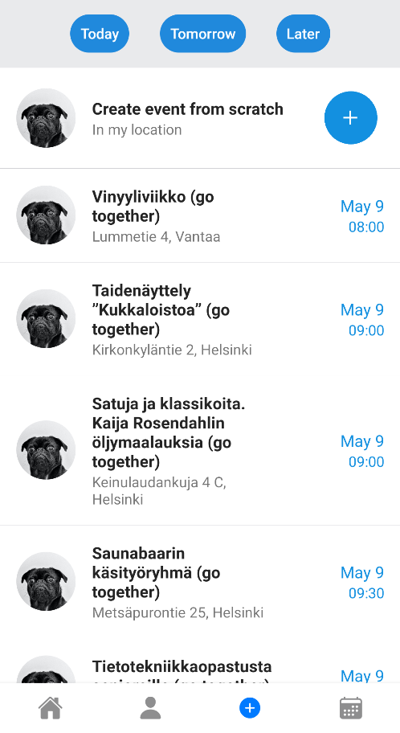
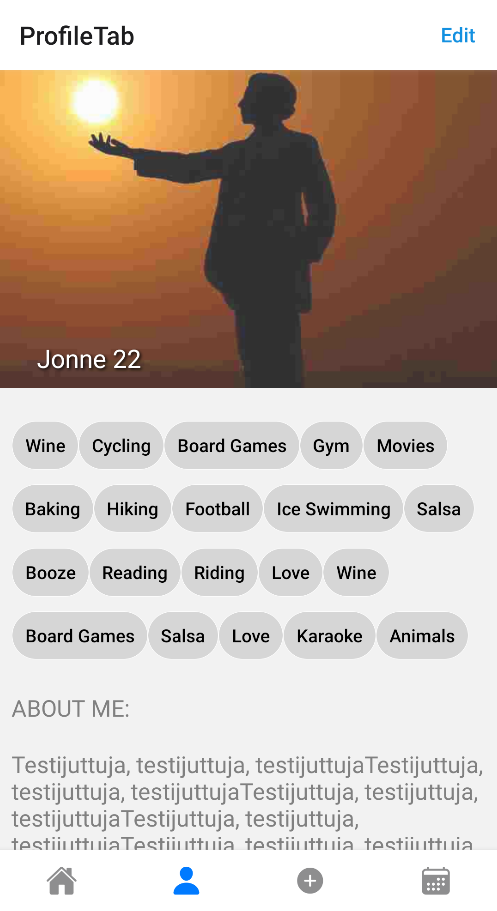
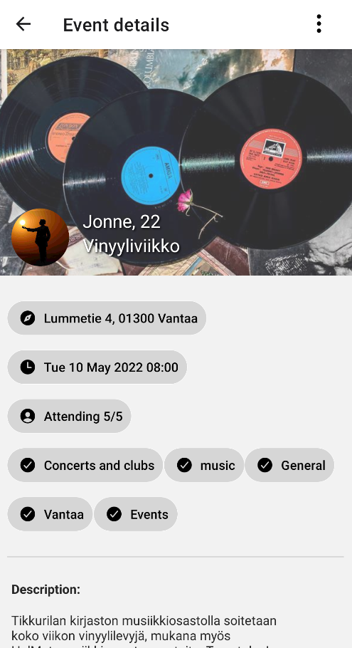
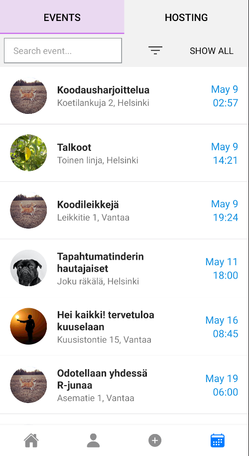

<div id="top"></div>

<!-- PROJECT LOGO -->
<div align="center">
    
  </a>
</div>

<!-- TABLE OF CONTENTS -->
<details>
  <summary>Table of Contents</summary>
  <ol>
    <li>
      <a href="#about-the-project">About The Project</a>
    </li>
    <li>
      <a href="#getting-started">Getting Started</a>
      <ul>
        <li><a href="#prerequisites">Prerequisites</a></li>
        <li><a href="#installation">Installation</a></li>
      </ul>
    </li>
    <li><a href="#technologies">Technologies</a></li>
    <li><a href="#roadmap">Roadmap</a></li>
    <li><a href="#acknowledgments">Acknowledgments</a></li>
  </ol>
</details>

<!-- ABOUT THE PROJECT -->
## About The Project

Hello Strangers is a mobile app created for Haaga-Helia's Software Project II -course (10 ECTS) in spring 2022. Project team consisted of 6 students.

With Hello Strangers users can explore and create events based on own interests. Main point of this app is to help users find other people who are interested in the same things and maybe even form new friendships.

You will find general information and instructions concerning Hello Strangers on this page.

<br />
  
&nbsp;&nbsp;
&nbsp;&nbsp;

<p align="right">(<a href="#top">back to top</a>)</p>


<!-- GETTING STARTED -->
## Getting Started
  
### Prerequisites
  - Using the app requires creating an account with your email address and name.
  - Currently only available on android.

### Installation

  There's two options:
  
1.
    Clone the repo
    ```sh
    git clone https://github.com/Tapahtumatinder/Hello_Strangers_App
    ```
    Install NPM packages
    ```sh
    npm install
    ```
    Start app
    ```sh
    expo start
    ```
2.
    Download Expo Go on your phone or emulator.
      - [Google Play](https://play.google.com/store/apps/details?id=host.exp.exponent&hl=en&gl=US)
      - [iOS App Store](https://apps.apple.com/us/app/expo-go/id982107779)

    Scan this QR code here or open the [Expo Go page](https://expo.dev/@maruzella/hello_strangers_app).
    
    

<p align="right">(<a href="#top">back to top</a>)</p>
  

<!-- Technologies -->
## Technologies

### Built on
* [Expo](https://expo.dev/)
* [ReactNative.js](https://reactnative.dev/)
* [Firebase](https://firebase.google.com/)
    * [Firestore Database](https://firebase.google.com/docs/firestore)
    * [Authentication](https://firebase.google.com/docs/auth)
    * [Cloud storage](https://firebase.google.com/docs/storage)

### API
* [MyHelsinki API](https://open-api.myhelsinki.fi/)

#### Libraries
* [React Native Elements](https://reactnativeelements.com/)
* [Expo Vector Icons](https://docs.expo.dev/guides/icons/)
* [React Native Community Datetimepicker](https://github.com/react-native-datetimepicker/datetimepicker)
* [Date-fns](https://date-fns.org/)
* [React Native Navigation](https://reactnavigation.org/docs/getting-started)

<p align="right">(<a href="#top">back to top</a>)</p>


<!-- ROADMAP -->
## Roadmap

- [ ] Chat
  - [ ] Ask oraganizer questions
  - [ ] Chat with other attendees
  - [ ] Chat with people from previous events
- [ ] Badges
- [ ] Reviews

See the [project Trello](https://trello.com/b/1zXl95xR/tulevaisuus-sprint) for a full list of proposed features (and known issues).

<p align="right">(<a href="#top">back to top</a>)</p>


<!-- ACKNOWLEDGMENTS -->
## Acknowledgments

We would like to thank our teachers and our peer support group for working with us.

<p align="right">(<a href="#top">back to top</a>)</p>
