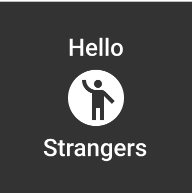

<div id="top"></div>

<!-- PROJECT LOGO -->
<br />
<div align="center">
  <h1>Hello Stranger<h1>
    
  </a>


</div>


<!-- TABLE OF CONTENTS -->
<details>
  <summary>Table of Contents</summary>
  <ol>
    <li>
      <a href="#about-the-project">About The Project</a>
      <ul>
        <li><a href="#built-with">Built With</a></li>
      </ul>
    </li>
    <li>
      <a href="#getting-started">Getting Started</a>
      <ul>
        <li><a href="#installation">Installation</a></li>
      </ul>
    </li>
    <li><a href="#pictures">Pictures</a></li>
    <li><a href="#usage">Usage</a></li>
    <li><a href="#roadmap">Roadmap</a></li>
    <li><a href="#contact">Contact</a></li>
    <li><a href="#acknowledgments">Acknowledgments</a></li>
  </ol>
</details>


<!-- ABOUT THE PROJECT -->
## About The Project

[![Product Name Screen Shot][product-screenshot]](https://example.com)

Tapahtumatinder is a mobile app created for Haaga-Helia's Software Project II -course (10 ECTS) in spring 2022. Project team consisted of 5 students.

With Tapahtumatinder users can explore and create events based on own interests. Main point of this app is to help users find other people who are interested in the same things and maybe even form new friendships.

You will find general information and instructions concerning Tapahtumatinder on this page.


<p align="right">(<a href="#top">back to top</a>)</p>


### Built With

* [ReactNative.js](https://reactnative.dev/)
* [Firebase](https://firebase.google.com/)
* [MyHelsinki API](https://open-api.myhelsinki.fi/)

<p align="right">(<a href="#top">back to top</a>)</p>


<!-- GETTING STARTED -->
## Getting Started

This is an example of how you may give instructions on setting up your project locally.
To get a local copy up and running follow these simple example steps.

### Installation

1. Clone the repo
   ```sh
   git clone https://github.com/Tapahtumatinder/Hello_Strangers_App
   ```
2. Install NPM packages
   ```sh
   npm install
   ```
3. Start app
   ```sh
   expo start
   ```

<p align="right">(<a href="#top">back to top</a>)</p>
  
  
<!-- PICTURES -->
## Pictures
&nbsp;&nbsp;&nbsp;&nbsp;&nbsp;&nbsp;

<p align="right">(<a href="#top">back to top</a>)</p>


<!-- USAGE -->
## Usage

Use this space to show useful examples of how a project can be used. Additional screenshots, code examples and demos work well in this space. You may also link to more resources.

_For more examples, please refer to the [Documentation](https://example.com)_

<p align="right">(<a href="#top">back to top</a>)</p>


<!-- ROADMAP -->
## Roadmap

- [ ] Chat
  - [ ] Ask oraganizer questions
  - [ ] Chat with other attendees
  - [ ] Chat with people from previous events
- [ ] Badges
- [ ] Reviews

See the [project Trello](https://trello.com/b/1zXl95xR/tulevaisuus-sprint) for a full list of proposed features (and known issues).

<p align="right">(<a href="#top">back to top</a>)</p>


<!-- CONTACT -->
## Contact

Your Name - [@twitter_handle](https://twitter.com/twitter_handle) - email@email_client.com

Project Link: [https://github.com/github_username/repo_name](https://github.com/github_username/repo_name)

<p align="right">(<a href="#top">back to top</a>)</p>


<!-- ACKNOWLEDGMENTS -->
## Acknowledgments

* []()
* []()
* []()

<p align="right">(<a href="#top">back to top</a>)</p>


<!-- MARKDOWN LINKS & IMAGES -->
<!-- https://www.markdownguide.org/basic-syntax/#reference-style-links -->
[contributors-shield]: https://img.shields.io/github/contributors/github_username/repo_name.svg?style=for-the-badge
[contributors-url]: https://github.com/github_username/repo_name/graphs/contributors
[forks-shield]: https://img.shields.io/github/forks/github_username/repo_name.svg?style=for-the-badge
[forks-url]: https://github.com/github_username/repo_name/network/members
[stars-shield]: https://img.shields.io/github/stars/github_username/repo_name.svg?style=for-the-badge
[stars-url]: https://github.com/github_username/repo_name/stargazers
[issues-shield]: https://img.shields.io/github/issues/github_username/repo_name.svg?style=for-the-badge
[issues-url]: https://github.com/github_username/repo_name/issues
[license-shield]: https://img.shields.io/github/license/github_username/repo_name.svg?style=for-the-badge
[license-url]: https://github.com/github_username/repo_name/blob/master/LICENSE.txt
[linkedin-shield]: https://img.shields.io/badge/-LinkedIn-black.svg?style=for-the-badge&logo=linkedin&colorB=555
[linkedin-url]: https://linkedin.com/in/linkedin_username
[product-screenshot]: images/screenshot.png
  
## Project links:

#### User stories and design
[Figma](https://www.figma.com/file/sqIHxyv7r7DaS7Yk456HtU/Tapahtumatinder)

#### Backlog
[Trello](https://trello.com/hhx16745008)
  - [Sprint 1](https://trello.com/b/mhbG4wKd/sprint-1)
  - [Sprint 2](https://trello.com/b/Mk9oyoro/sprint-2)
  - [Sprint 3](https://trello.com/b/9gbxRxi4/sprint-3)
  - [Sprint 4](https://trello.com/b/0UKkPoPE/sprint-4)
  
#### Videos
- [Demo_preview_0.1](https://www.youtube.com/watch?v=GxT617yNe40)

#### Management
- [Firebase](https://console.firebase.google.com/u/4/project/hellostrangersapp/overview)

#### Map tools (geocoding)
- [Mapquest](https://developer.mapquest.com/documentation/geocoding-api/) tai [Googlen API](https://developers.google.com/maps/documentation/geocoding/overview)

#### MyHelsinki API
- [information](https://hri.fi/data/dataset/myhelsinki-open-api-paikat-tapahtumat-ja-aktiviteetit)
- [events data](http://open-api.myhelsinki.fi/v1/events/)
